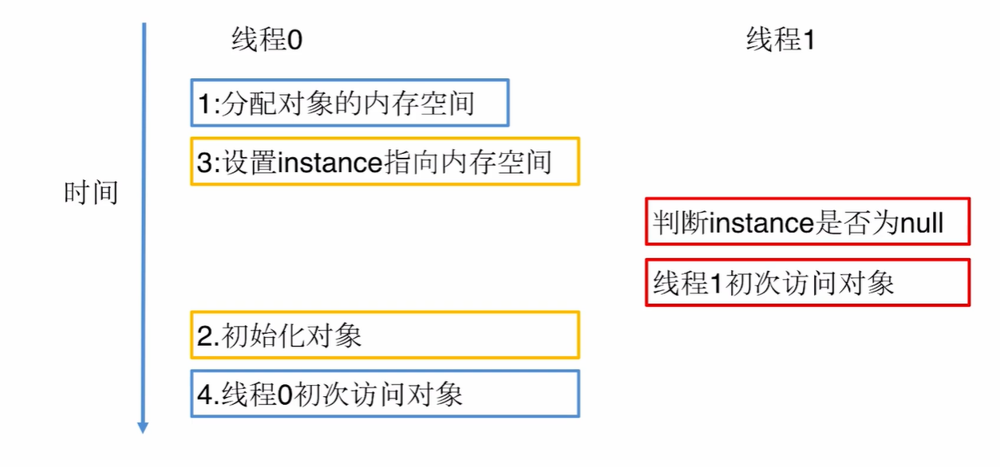
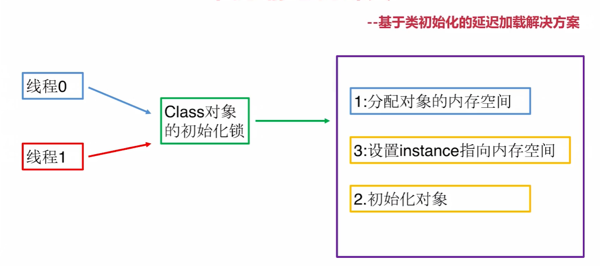

# 定义
保证一个类仅有一个实例，并提供一个唯一访问方式

# 适用场景
1、确保任何场景都只有一个实例（线程池、数据库连接池、单服务的计数器等）

# 优点：
1、保证对象只被实例化一次，较少内存开销

2、由单例对象封装，可以控制客户端怎样访问和什么时候访问（对唯一实例的受控访问）

3、避免对资源的重复占用

# 缺点：
1、没有接口，扩展困难

# 重点
私有构造；延迟加载；线程安全；序列化和反序列化安全；反射；

# 指令重排序问题
方案一：禁止指令重排序(volatile)

方案二：允许指令重排序，但是对其他线程不可见(静态内部类单例)
