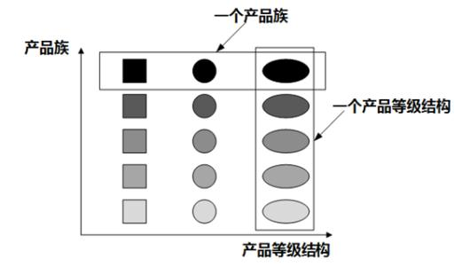

# 定义
供一个创建一系列相关或互相依赖的接口，而不需要指定他们具体的类

# 适用场景
1、客户端不依赖产品类实例如何创建和实现的细节

2、强调一系列产品对象（产品族）一起使用创建对象需要大量重复的代码

3、提供一个产品类的库，所有产品使用同样接口创建，从而使客户端不依赖具体实现

# 优点：
1、易于替换产品族，只需更换工厂即可（将一系列产品族统一到一起创建）；

2、实例创建过程与客户端分离，客户端通过接口操作具体实例，无需关心创建细节；

# 缺点
1、如果产品族需要增加产品，则需要增加产品抽象类、具体实现类，以及修改抽象工厂接口；

2、由于需要在使用时指定工厂，如果项目中多处地方使用到，则全部需要替换；（可结合简单工厂模式进行改造）

3、增加了系统抽象性和理解难度

# 产品等级和产品族
